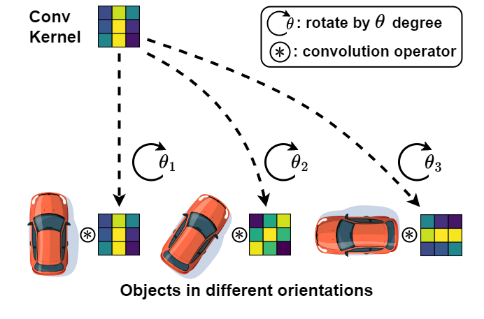
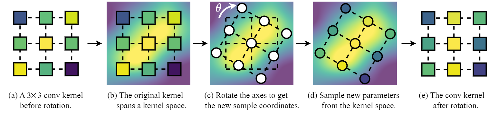
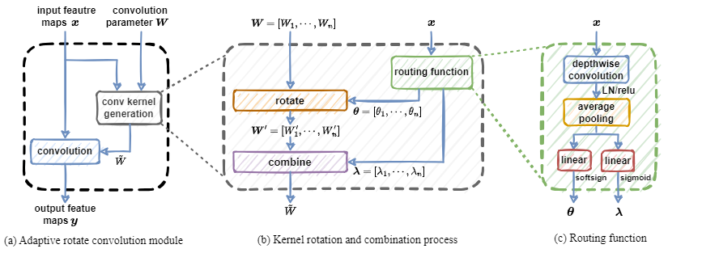

# Adaptive Rotated Convolution for Rotated Object Detection (ICCV 2023)


Authors: [Yifan Pu](https://github.com/yifanpu001/)\*, [Yiru Wang](https://scholar.google.com/citations?user=Ug87_McAAAAJ&hl=zh-CN)\*, [Zhuofan Xia](https://github.com/Vladimir2506/)\, [Yizeng Han](https://yizenghan.top/), [Yulin Wang](https://www.wyl.cool/), Weihao Gan, Zidong Wang, [Shiji Song](https://scholar.google.com/citations?user=rw6vWdcAAAAJ&hl=en), [Gao Huang](http://www.gaohuang.net/)\#.

*: Equal contribution, #: Corresponding author.

## Introduction

This is the official implementation of the paper, *[Adaptive Rotated Convolution for Rotated Object Detection](https://arxiv.org/abs/2303.07820)* (ICCV 2023). This paper presents a novel adaptive rotation convolutional operation to capture orientation information of objects in images. It enhances the performance of rotated object detectors and achieves high efficiency in rotated object detection scenarios.


### Motivation

<div align="center">
  
</div>

### Rotate the convolution kernels

<div align="center">
  
</div>

### Overall method

<div align="center">
  
</div>

## Get Started
(1) Prepare environment

```shell
# create environment
conda create -n arc python=3.7 -y
conda activate arc

# install pytorch and torchvision
pip install torch==1.7.0+cu110 torchvision==0.8.1+cu110 -f https://download.pytorch.org/whl/torch_stable.html

# clone this codebase, including submodule
git clone https://github.com/LeapLabTHU/ARC.git --recursive

# install submodule
cd BboxToolkit
pip install -v -e .
cd ..

# install mmcv
pip install mmcv-full==1.3.9 -f https://download.openmmlab.com/mmcv/dist/cu110/torch1.7.0/index.html

# install other requirements
pip install -r requirements/build.txt
pip install mmpycocotools
pip install einops

# install this codebase
pip install -v -e .
```

(2) Prepare data

Download the DOTA dataset from [official website](https://captain-whu.github.io/DOTA/dataset.html), 
change the diretory in ```./BboxToolkit/tools/split_configs/dota1_0/ss_trainval.json``` and ```./BboxToolkit/tools/split_configs/dota1_0/ss_test.json```,
and then run the following script

```shell
cd ./BboxToolkit/tools/
python img_split.py --base_json split_configs/dota1_0/ss_trainval.json
python img_split.py --base_json split_configs/dota1_0/ss_test.json
```

(3) Download the pretrained backbone

Download the pretrained ARC-ResNet from [TsinghuaCloud](https://cloud.tsinghua.edu.cn/d/46177201209d4d2a827b/) or [GoogleDrive](https://drive.google.com/drive/folders/1ObJYPpD4oFPudGhCnLI5ZsBrLbkpdLRY?usp=drive_link), then put it in ```./pretrained/```.

(4) Change data path

In the file ./configs/obb/_base_/datasets/dota.py, change the data path following ```data_root``` to ```YOUR_DATA_PATH```.


## Usage

### Training

```
# train a Oriented R-CNN model with ARC-ResNet50 backbone
python tools/train.py configs/obb/arc/arc_orcnn_r50fpn1x_ss_dota10_RxFFF_n4.py;

# train a Oriented R-CNN model with ARC-ResNet101 backbone
python tools/train.py configs/obb/arc/arc_orcnn_r101fpn1x_ss_dota10_RxFFF_n4.py;
```

### Testing
```
python tools/test.py configs/obb/arc/arc_orcnn_r50fpn1x_ss_dota10_RxFFF_n4.py \
YOUR_CHECKPOINT_PATH --format-only --options save_dir=YOUR_SAVE_DIR;

python tools/test.py configs/obb/arc/arc_orcnn_r101fpn1x_ss_dota10_RxFFF_n4.py \
YOUR_CHECKPOINT_PATH --format-only --options save_dir=YOUR_SAVE_DIR;
```

We provide the pretrained models as listed below.

| Detector  | Backbone | box AP<br />(in paper) | box AP<br />(this repo) | pretrained model |
| :---: | :---: | :---: | :---: | :---: |
| Oriented R-CNN | ARC-ResNet50  | 77.35 | 77.42 | [TsinghuaCloud](https://cloud.tsinghua.edu.cn/f/c46ce99d2c594d759fcb/?dl=1) / [GoogleDrive](https://drive.google.com/file/d/10pSdHXCpRMpkuyFWYxhpLJjZ4L_0qdo2/view?usp=drive_link) |
| Oriented R-CNN | ARC-ResNet101 | 77.70 | 77.75 | [TsinghuaCloud](https://cloud.tsinghua.edu.cn/f/8cd70d10248540b280ee/?dl=1) / [GoogleDrive](https://drive.google.com/file/d/1CkM_AbutSSDAfdqzDV3emdiZrOqC-jfX/view?usp=drive_link) |


## Acknowledgement

This code is developed on the top of [OBBDetection](https://github.com/jbwang1997/OBBDetection), we thank to their efficient and neat codebase.

## Citation

If you find our work is useful in your research, please consider citing:

```
@InProceedings{pu2023adaptive,
  title     = {Adaptive Rotated Convolution for Rotated Object Detection},
  author    = {Pu, Yifan and Wang, Yiru and Xia, Zhuofan and Han, Yizeng and Wang, Yulin and Gan, Weihao and Wang, Zidong and Song, Shiji and Huang, Gao},
  booktitle = {Proceedings of the IEEE/CVF International Conference on Computer Vision (ICCV)},
  year      = {2023}
}
```

## Contact
If you have any questions or concerns, please send email to [pyf20@mails.tsinghua.edu.cn](mailto:pyf20@mails.tsinghua.edu.cn).